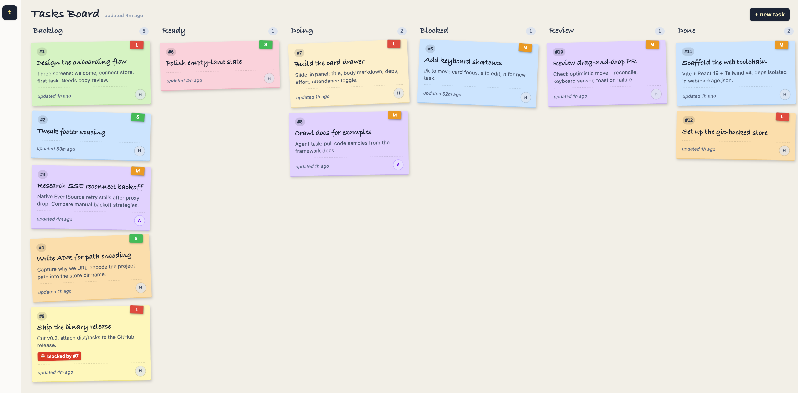

# tasks

A git-backed, file-per-task CLI for tracking work across six columns, designed so humans and Claude Code agents drive the same surface. Each task is a markdown file with YAML frontmatter, kept in a per-project git repository under `$TASKS_HOME`. Every mutation is an atomic commit, so the history is the audit log.

## Why

- Tasks live in plain files you can grep, diff, and back up.
- The store is a git repo, so `git log` shows exactly what changed and when.
- The same CLI is driven by humans (short IDs, human renderer) and agents (UUIDs, `--json`, stable error codes).
- Open transitions, strict DAG: the validator protects the graph, not the workflow.

The store directory is keyed off the **Project root** (nearest ancestor of `pwd` with a `.git/`, else `pwd`), under `$TASKS_HOME/projects/<encoded-path>/`. Each task lives in one of six **Column** directories (`backlog`, `ready`, `doing`, `blocked`, `review`, `done`); moving columns is a `git mv`. See [CONTEXT.md](./CONTEXT.md) for the full glossary.

## Requirements

- [Bun](https://bun.sh) 1.3.13 or newer
- `flock` on `PATH` (macOS: `brew install flock`)
- `git`

## Install

From the repo root:

```sh
bun install
bun link                # exposes `tasks` on $PATH
tasks --help
```

For a standalone binary (no Bun at runtime): `bun run build` produces `dist/tasks` (CLI only — it does **not** embed the web board UI). To get a binary with the board baked in, use `bun run build:binary`, which builds the web app and embeds it before compiling. To run without linking while developing: `bun run src/cli.ts <command> [...args]`.

Environment:
- `$TASKS_HOME` — where stores live (default `~/.tasks`). Tests override it for hermetic tempdirs.
- `$TASKS_NOW` — ISO-8601 timestamp that freezes the clock for `created_at`/`updated_at` and the `done` cutoff window; unparseable values are ignored. See [ADR-0015](./docs/adr/0015-injectable-clock-via-tasks-now.md).

## Quickstart

```sh
tasks new "Wire up OAuth flow"                       # create in backlog
tasks new "Ship notes" --unattended --effort low --deps 3
tasks mv 1 doing                                     # move a column
tasks link 2 --depends-on 1                          # add a dep edge
tasks next --unattended                              # oldest ready, agent-safe
tasks export --json                                  # whole store for agents
```

## Web board

`tasks serve` boots a localhost web board for the current project's store. It is a single-user, read-write view of the same six columns the CLI drives, served from the compiled binary with no extra setup.

```sh
tasks serve                 # listen on http://127.0.0.1:4317
tasks serve --port 8080     # pick a port (0 lets the OS choose)
```

The board UI has to be built before `tasks serve` can show it. There are two ways:

- **From a linked / source install** (`bun link`, or `bun run src/cli.ts`): build the web app once with `bun run build:web`. After that, `tasks serve` auto-serves the built `web/dist`, so the URL shows the real board.
- **From the compiled binary**: `bun run build:binary` embeds the UI, so `./dist/tasks serve` needs no separate web build.

If you haven't built the UI, `tasks serve` still runs the JSON API and now shows a short page at `/` telling you which command to run, instead of a raw error. If `serve` exits with `EADDRINUSE`, a board is already listening on that port — open it, or pass `--port 0` for a fresh one.

The command prints the listening URL on stdout; open it in a browser:

```
tasks board listening on http://127.0.0.1:4317
```



What it does:

- **Live updates.** A single filesystem watch on the store rebroadcasts the full board to every open tab over SSE, so a `tasks mv` in the terminal (or an edit from an agent) moves the card in the browser within a moment, no refresh needed. Cards animate when an external change shifts their lane.
- **Read-write, git-backed.** Creating a task, moving a card between columns, and editing title/body/effort/attendance all reuse the same core as the CLI (flock, dirty-tree guard, validator, one commit per change). The board is just another driver of the store, so every change is still a commit you can `git log`.
- **Localhost only.** The server binds to `127.0.0.1` with no auth, on the single-user assumption. It refuses to start (non-zero exit, `NOT_INITIALIZED`) when the store does not exist yet, so run `tasks init` first. See [ADR-0016](./docs/adr/0016-board-server-reuses-core-in-process.md) for the design.

The board exposes a small JSON API under `/api` (`GET /api/board`, `GET /api/events` for the SSE stream, `POST /api/tasks`, `POST /api/tasks/:id/move`, `PATCH /api/tasks/:id`) using the same error envelope and codes as the CLI.

## Claude Code skill

The repo ships a [Claude Code](https://claude.com/claude-code) skill in [`skill/`](./skill/SKILL.md). It teaches an agent to drive `tasks` as its own working memory: when you hand Claude a multi-step job, it creates one task per slice, wires up the dependencies, and moves cards across the board as it works, so the progress survives a dropped session and you can watch it live on the web board.

Install it by copying (or symlinking) the folder into your skills directory:

```sh
# user-wide, available in every project
ln -s "$PWD/skill" ~/.claude/skills/tasks

# or per-project, checked in alongside the repo it tracks
ln -s ../../skill your-project/.claude/skills/tasks
```

Claude consults it on its own once installed. It triggers on multi-step work (three or more steps, or any ordering between them) and on direct board requests like "add a task", "what's blocking X", or "show me the board". A one-line edit won't trigger it, the bookkeeping isn't worth it there.

What it looks like in practice. You ask Claude to "add rate limiting to the API and write tests for it." Instead of holding the plan in its head, it lays the work on the board and walks it:

```sh
tasks new "Add rate-limit middleware" --unattended          # task: new #4
tasks new "Tests for rate limiter" --unattended --deps 4    # tests wait on the impl
tasks mv 4 ready && tasks next --unattended                 # pull the unblocked slice
tasks mv 4 doing                                            # ...writes the middleware...
tasks mv 4 done                                             # tests are now unblocked
```

The payoff: because every move is a git commit, the board is a durable, diffable record. If the session drops mid-task you reopen the board and see "middleware done, tests in review" instead of guessing, and you can watch the cards move in real time at `tasks serve` while the agent works.

## Frontmatter shape

```yaml
id: 42
uuid: 7f3a9c2e-...
title: add OAuth flow
deps: ["uuid-a", "uuid-b"]
attendance: attended      # or "unattended" (agent pickup gate)
effort: medium            # low | medium | high
created_at: 2026-05-27T10:14:00Z
updated_at: 2026-05-27T10:14:00Z
```

`id`, `uuid`, `title`, `created_at`, `updated_at` are required. `deps` defaults to `[]`, `attendance` to `attended`, `effort` to `medium`. Body is free-form markdown; a `## Acceptance Criteria` section is parsed into `acceptance_criteria` on `--json` reads.

## Reference

- [docs/commands.md](./docs/commands.md) — every command, flag, JSON shape, and error code. Also `tasks --help` and `tasks <command> --help`.
- [CONTEXT.md](./CONTEXT.md) — glossary of canonical terms.
- [docs/adr/](./docs/adr/) — architecture decisions and rationale.
- [CLAUDE.md](./CLAUDE.md) — agent-facing pointer and TDD working method.
- [CHANGELOG.md](./CHANGELOG.md) — release history.

## Tests

```sh
bun run test          # parallel across workers
bun run test:serial   # one file at a time
bunx tsc --noEmit
```

Tests spawn the CLI via `Bun.spawn` against a tempdir `TASKS_HOME` and assert on stdout, stderr, exit codes, and on-disk state. No git mocking, no assertions on internal modules. The `--timeout 30000` in `bun run test` is deliberate: each test forks the CLI plus several `git` processes, so under heavy parallelism CPU-bound tests would exceed the 5s default. See [CLAUDE.md](./CLAUDE.md) for the working method.

## License

Private.
